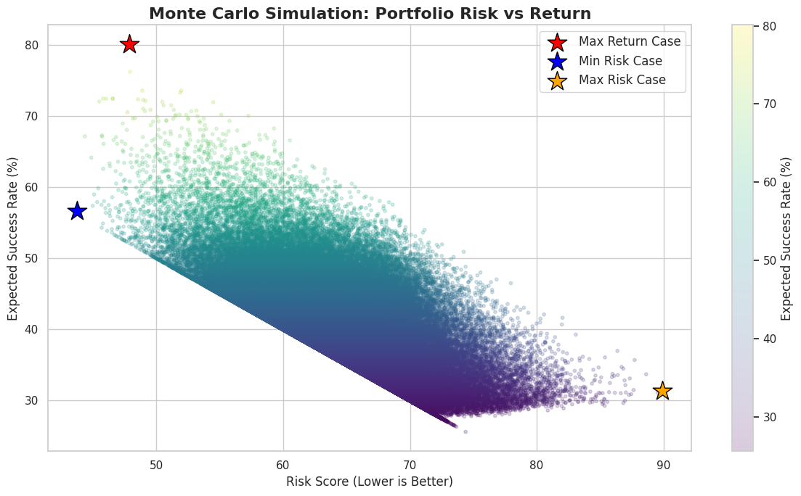
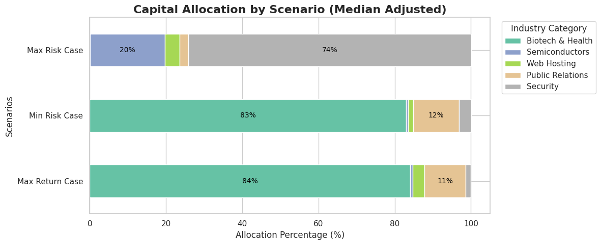

# Spark 기반 스타트업 폐업률 분석과 몬테카를로 포트폴리오 최적화

> 빅데이터분석 기말 프로젝트 — Apache Spark 분산 전처리·집계와 10만 회 몬테카를로 시뮬레이션을 활용한 벤처 투자 포트폴리오 분석

> 💡 **핵심 결과:** Crunchbase 스타트업 데이터를 Spark로 전처리·집계하여 국가·산업별 폐업률과 투자금액–생존율 관계를 분석하고, **10만 개 포트폴리오 시나리오**를 몬테카를로로 탐색해 위험–수익 효율 경계와 자본 배분안을 도출했습니다.

---

## 1. 문제 정의 (Problem Statement)

벤처 투자자는 한정된 자본을 여러 산업·국가의 스타트업에 배분할 때 **"어디에 투자해야 폐업 위험은 낮고 성공(인수·IPO) 가능성은 높은가"** 를 판단해야 합니다. 그러나 공개 데이터에는 펀드 수익률(IRR)이 없으므로, 본 분석은 성과를 다음으로 정의합니다.

- **폐업률:** `status == closed` 비율 (낮을수록 안정적)
- **성공률:** `status ∈ {acquired, ipo}` 비율 (성공 엑시트)
- **생존율:** `status != closed` 비율

이를 통해 국가·산업 단위의 위험을 측정하고, 이를 입력으로 몬테카를로 시뮬레이션을 돌려 **위험 대비 기대 성공률이 가장 높은 자본 배분**을 탐색합니다.

- **해결 주체:** 초기 단계 벤처 투자자 / 액셀러레이터
- **분석 목표:** ① 국가·산업별 폐업/성공률 정량화 ② 위험 대비 수익이 효율적인 자본 배분안 도출

---

## 2. 선행자료 조사 및 포지셔닝 (Related Work)

스타트업 투자 의사결정은 학계(이론 모델)와 산업(실증 통계) 양쪽에서 다뤄져 왔습니다. 대표 선행연구 2건을 검토해 본 프로젝트의 위치를 설정합니다.

| 선행 연구 | 핵심 내용 | 한계 (미해결 과제) | 본 프로젝트의 차별점 |
|-----------|-----------|--------------------|----------------------|
| **Ferreira & Pereira (2021), _EJOR_** — VC 진입·엑시트 투자결정 동적 모델 | 실물옵션(real options) 기반으로 진입·엑시트 **타이밍**, 최적 지분, 기대 cash multiple(≈10.2)을 도출 | 가정(성장률·시너지·변동성) 기반 **이론·해석 모델**로, 실제 기업 데이터로 검증되지 않음 | 동일한 "투자 의사결정" 문제를 **실데이터 + 시뮬레이션**으로 실증 |
| **CB Insights — The Venture Capital Funnel** | 시드 투자 코호트를 추적해 단계별로 **극소수만 후속 라운드·엑시트에 도달**하는 "깔때기" 구조를 제시 | 산업 전체의 **기술 통계(descriptive)** 로, 산업·국가별 차이나 자본 배분 처방은 없음 | 국가·산업별 폐업률로 깔때기를 분해하고, 몬테카를로로 **실행 가능한 배분안**까지 산출 |

> 📌 **포지셔닝:** Ferreira & Pereira는 "언제 들어가고 나올 것인가"를 이론적으로, CB Insights는 "얼마나 살아남는가"를 통계적으로 다뤘습니다. 본 프로젝트는 이를 **실데이터 위에서 결합** — Spark 집계로 산업·국가별 위험을 측정하고, 분산 시뮬레이션으로 포트폴리오 위험관리를 더해 투자자가 바로 쓸 수 있는 자본 배분안을 도출합니다.

---

## 3. 데이터 및 방법론 (Data & Methods)

| 항목 | 내용 |
|------|------|
| 데이터 출처 | Kaggle: `yanmaksi/big-startup-secsees-fail-dataset-from-crunchbase` |
| 파일 | `big_startup_secsees_dataset.csv` |
| 처리 엔진 | **Apache Spark (PySpark)** — 분산 전처리·집계 |
| 주요 필드 | `funding_total_usd`, `country_code`, `category_list`, `status` |
| 파생 변수 | `is_closed`, `is_survived`, `is_success`, `funding_log`(로그 변환) |
| 분석 기법 | 로그 변환 상관분석, 투자금 10분위(Decile) 추이, **몬테카를로 10만 회**(numpy) |
| 시각화 | Matplotlib · Seaborn (위험–수익 산점도, 자본 배분 누적 막대) |

### 전처리 핵심 (에러 원천 차단)
`funding_total_usd`는 문자열에 통화 기호·콤마가 섞여 있어, **① 숫자/소수점만 추출 → ② 정규식으로 완전한 숫자 형태인지 재검증 → ③ 유효할 때만 `Double` 캐스팅, 아니면 `Null` 처리 → ④ 결측 행 제거** 순으로 정제했습니다. Spark의 ANSI 모드를 비활성화하여 형변환 실패를 안전하게 처리했습니다.

### 롱테일 왜곡 보정
투자금은 소수 대형 거래로 분포가 극단적으로 치우쳐 있어, 평균이 왜곡됩니다. 이를 막기 위해 **① 상관분석에는 로그 변환(`log1p`)**, **② 카테고리별 필요 자본에는 평균 대신 중앙값(median)** 을 적용해 분석의 신뢰도를 높였습니다.

---

## 4. 빅데이터 수집·처리 환경 (Big Data Architecture)

| 구성 요소 | 적용 기술 | 채택 근거 |
|-----------|-----------|-----------|
| **병렬 분산처리** | Apache Spark (DataFrame) | 전체 데이터를 분산 파티션으로 로드해 국가·산업별 집계(`groupBy`)를 병렬 수행 |
| **시뮬레이션 연산** | 몬테카를로 10만 회 (numpy) | 데이터 양이 아닌 **배분 시나리오 탐색 연산** 규모로 분석 부하를 정당화 |

```
[Kaggle CSV] → [Spark 분산 전처리·집계] → [카테고리별 지표] → [몬테카를로 시뮬레이션] → [시각화]
```

> ℹ️ 본 버전은 Spark 병렬 분산처리 중심으로 구성했으며, NoSQL·실시간 처리는 적용 범위에서 제외했습니다(향후 확장 과제).

---

## 5. 핵심 결과 (Key Findings)

### 5-1. 국가별 폐업률 (표본 50개 이상)

| 폐업률 최고 (위험) | 폐업률 | | 폐업률 최저 (안정) | 폐업률 |
|--------------------|:---:|---|--------------------|:---:|
| 🇷🇺 러시아 (RUS) | **39.1%** | | 🇨🇱 칠레 (CHL) | **3.4%** |
| 🇮🇩 인도네시아 (IDN) | 14.8% | | 🇨🇳 중국 (CHN) | 3.8% |
| 🇳🇿 뉴질랜드 (NZL) | 13.8% | | 🇦🇪 UAE (ARE) | 4.0% |
| 🇧🇷 브라질 (BRA) | 13.7% | | 🇰🇷 한국 (KOR) | 4.1% |
| 🇨🇿 체코 (CZE) | 11.3% | | 🇮🇳 인도 (IND) | 4.2% |

> 러시아가 39.1%로 폐업률이 압도적으로 높고, 칠레·중국·한국·인도 등 신흥·아시아 시장이 상대적으로 안정적입니다.

### 5-2. 산업 카테고리별 폐업률 (표본 50개 이상)

| 폐업률 최고 (위험) | 폐업률 | | 폐업률 최저 (안정) | 폐업률 |
|--------------------|:---:|---|--------------------|:---:|
| Public Relations | **23.0%** | | Consumer Electronics | 0.0% |
| Curated Web | 18.8% | | Real Estate | 2.4% |
| Search | 15.0% | | Education | 3.0% |
| Social Media | 14.0% | | Nonprofits | 3.3% |
| Advertising | 13.6% | | Fashion | 3.4% |

> 홍보(PR)·큐레이션 웹·검색 등 경쟁이 치열한 분야가 폐업률이 높고, 소비자 가전·부동산·교육이 안정적입니다.
> ⚠️ 폐업률 최저 목록에는 `Biotechnology|Hea...`(n=110, 0.0%) 같은 **멀티태그 소수 표본**도 섞여 있어, 이는 아래 §8 한계에서 다루는 아티팩트와 동일한 현상입니다.

### 5-3. 투자금과 성과의 관계 (상관분석 + 10분위 추이)

투자금은 소수 대형 거래로 분포가 심하게 치우쳐(롱테일) 있어, 로그 변환(`log1p`) 후 상관계수를 산출했습니다.

| 관계 | 상관계수 |
|------|:---:|
| 로그 투자금 ↔ 단순 생존(미폐업) | **0.0555** (거의 없음) |
| 로그 투자금 ↔ 성공 엑시트(인수/IPO) | **0.2727** (약~중간 양(+)) |

이 차이를 **투자금 10분위(Decile) 구간별 추이**로 분해하면 명확해집니다.

| 투자금 구간 | 생존율 | 성공률(Exit) |
|:---:|:---:|:---:|
| 1분위 (최저) | 87.4% | 1.3% |
| 5분위 | 91.7% | 7.7% |
| 10분위 (최고) | 93.6% | **29.8%** |

> 💡 **핵심 인사이트:** 투자금이 늘어도 **단순 생존율은 87→94%로 거의 변하지 않지만**, **성공 엑시트율은 1.3%→29.8%로 약 23배 폭증**합니다. 즉 **"돈은 스타트업을 *살려주지는* 못해도, *크게 성공(인수·IPO)*시키는 것과는 강하게 연결된다."** 투자자는 "생존"이 아니라 "성공 엑시트"를 목표로 자본을 배분해야 함을 시사합니다.

### 5-4. 카테고리별 포트폴리오 지표 (표본 100개 이상)
성공률과 필요 자본을 기준으로 시뮬레이션 입력 카테고리 5개를 선정했습니다. 필요 자본은 롱테일 왜곡을 피하기 위해 **평균이 아닌 중앙값(median)** 을 사용했습니다.

| 카테고리 | 성공률 | 필요 자본 중앙값(M$) |
|----------|--------|--------------------|
| Biotech & Health | 89.09% | 89.47 |
| Semiconductors | 30.26% | 13.15 |
| Web Hosting | 29.66% | 10.98 |
| Public Relations | 28.32% | 4.75 |
| Security | 25.14% | 6.57 |

### 5-5. 몬테카를로 포트폴리오 시뮬레이션 (롱테일 보정 · 재현성 고정)
- **총 예산 500M\$**, **10만 개** 무작위 배분 시나리오 생성 (`np.random.seed(42)`로 재현성 확보)
- 필요 자본은 §5-4의 **중앙값**을 사용해 현실적인 투자 가능 기업 수를 산출
- 리스크 점수 = `(100 − 기대성공률) + 집중 페널티`(투자 기업 수가 20개 미만일 때 가중)



*▲ 10만 개 포트폴리오의 위험–수익 분포(중앙값 보정). 좌상단(낮은 리스크·높은 성공률)일수록 효율적이며, 세 별표는 최대 수익(빨강)·최저 리스크(파랑)·최고 리스크(주황) 케이스.*



*▲ 세 시나리오의 산업별 자본 배분 비중. 최대 수익·최저 리스크 모두 Biotech 80%대 집중, 최고 리스크는 Security 집중.*

| 시나리오 | 예상 성공률 | 리스크 점수 | 투자 기업 수 | 주요 배분 |
|----------|:---:|:---:|:---:|------|
| 🔥 최대 수익 (Max Return) | 79.44% | 23.02 | 약 18.8개 | Biotech 84.1% · PR 10.8% |
| 🛡️ 최저 리스크 (Min Risk) | 78.65% | **21.35** | 약 20.5개 | Biotech 83.0% · PR 12.1% |
| 💣 최고 리스크 (Max Risk) | 26.41% | 73.59 | 약 68.0개 | Security 74.2% · Semi 19.7% |

> 💡 **인사이트:** 중앙값 보정으로 투자 가능 기업 수가 현실화되자(약 19~20개), 최대 수익·최저 리스크 케이스가 모두 **성공률 79%대·리스크 21~23**으로 수렴하며 Biotech 80%대 집중을 가리킵니다. 반대로 Biotech를 배제한 최고 리스크 케이스는 성공률이 26%로 급락합니다.
>
> ⚠️ **해석에 반드시 주의:** 이 "Biotech 집중" 결론은 자본의 80%대를 Biotech에 배분한 결과인데, 그 성공률(89%)은 §8에서 설명한 **소수 표본 아티팩트**입니다. 따라서 시뮬레이션이 가리키는 "Biotech 몰빵"은 **입력 데이터의 한계가 그대로 반영된 것**이며, 신뢰할 수 있는 단독 카테고리 값(Biotech 16.1%)으로 재산출하면 결론이 달라질 수 있습니다. 발표 시 이 점을 명시해야 합니다.

---

## 6. 분석 코드 스니펫 (Code Snippet)

### Spark 분산 전처리 — 안전한 형변환
```python
import pyspark.sql.functions as F
from pyspark.sql.types import DoubleType

cleaned = F.regexp_replace(F.col("funding_total_usd"), "[^0-9.]", "")
is_valid = cleaned.rlike(r"^\d+(\.\d+)?$")
df_clean = (df.withColumn("funding_total_usd",
                F.when(is_valid, cleaned.cast(DoubleType())).otherwise(F.lit(None)))
              .dropna(subset=["funding_total_usd"]))
```

### 몬테카를로 포트폴리오 시뮬레이션
```python
for _ in range(num_portfolios):           # 10만 회
    weights = np.random.random(len(categories)); weights /= weights.sum()
    expected_success = np.sum(weights * success_rates) * 100
    funded = np.sum((total_budget_m * weights) / avg_costs_m)
    risk = (100 - expected_success) + max(0, (20 - funded) * 2)
```

---

## 7. 기대효과 (Expected Impact)

- **투자자 관점:** 감(感)에 의존하던 분야 배분을, 폐업률·기대 성공률 기반 근거로 대체 → 위험 관리 강화
- **생태계 관점:** 국가·산업별 폐업률 지형도를 제공해 정책·투자 우선순위 판단에 활용
- **방법론 관점:** Spark 분산 집계 파이프라인은 데이터 규모가 커져도 동일 구조로 확장 가능

---

## 8. 결론 및 한계 (Conclusion & Limitations)

- **결론:** Spark 기반 집계로 국가·산업별 위험 지형을 파악하고, 이를 몬테카를로 시뮬레이션에 연결해 위험 대비 기대 성공률이 높은 자본 배분안을 정량적으로 제시했습니다.
- **제언:** 투자자는 단일 고성공률 산업에 집중하기보다, 효율 경계 부근의 분산 배분으로 투자 기업 수를 일정 수준 이상 확보하는 전략이 유리합니다.
- **한계 (검토 필요):**
  - **Biotech 89% 성공률은 통계 아티팩트입니다.** `category_list`가 파이프(`|`)로 묶인 **멀티태그**라, `groupBy("category_list")`는 `Biotechnology|Health Care|...` 같은 **태그 조합 하나하나를 별도 그룹**으로 취급합니다. 그 결과 특정 조합이 **소수 표본(약 110개)** 으로 쪼개지면서 성공률이 **89%로 과대평가**되었습니다. 반면 `Biotechnology` 단독(약 3,432개)의 성공률은 **16.1%** 로, 89%는 데이터의 실제 특성이 아니라 **그룹화 방식이 만든 가짜 수치**입니다. 본 버전은 이 값을 몬테카를로 입력으로 그대로 사용했으므로 "Biotech 집중" 결론이 과장될 수 있으며, 향후 **주 카테고리(첫 태그) 정규화 + 최소 표본 임계치(N≥200)** 보정이 필요합니다.
  - 밸류에이션·지분 희석 데이터 부재, 단일 시점 스냅샷, 엑시트 정의의 단순화(acquired/ipo).
  - 리스크 점수는 분산(공분산) 기반이 아닌 휴리스틱 정의로, 향후 Markowitz식 위험 모델로 확장 여지가 있습니다.
  - NoSQL·실시간 처리는 본 버전에서 제외 — 향후 MongoDB 적재 및 Streaming 갱신으로 확장 가능.

---

## 9. 참고 문헌 (References)

**선행 연구**
- Ferreira, R. M., & Pereira, P. J. (2021). A dynamic model for venture capitalists' entry–exit investment decisions. *European Journal of Operational Research, 290*(2), 779–789. https://doi.org/10.1016/j.ejor.2020.08.014
- CB Insights. *The Venture Capital Funnel.* https://www.cbinsights.com/research/venture-capital-funnel-2/

**데이터 출처**
- [Big Startup Success/Fail Dataset from Crunchbase](https://www.kaggle.com/datasets/yanmaksi/big-startup-secsees-fail-dataset-from-crunchbase)
